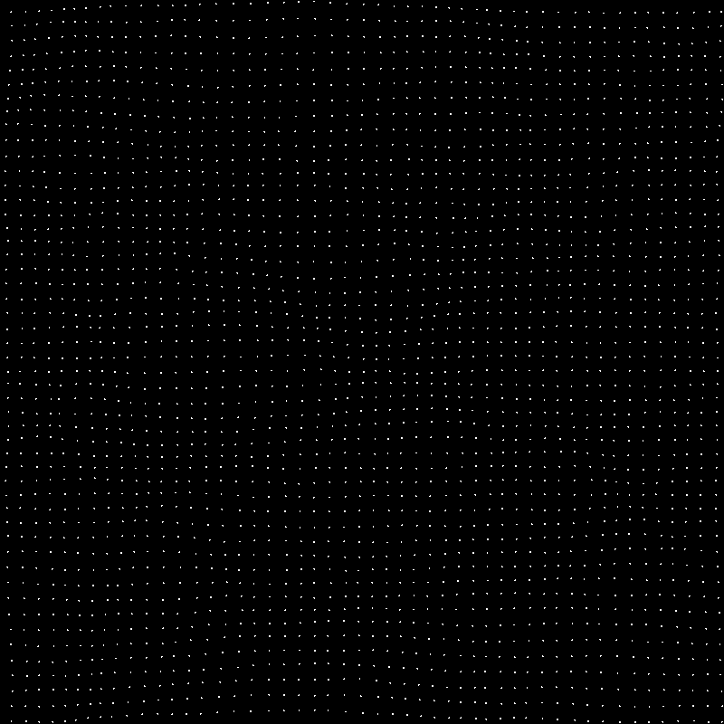

# Cosmological N-Body/Hydro Simulation Experiments

This repository documents my experiments in cosmological N-body/hydrodynamics simulations. It contains two "toy model" simulation programs, one in Python and one in C++, along with a book that explains the underlying physics and algorithms.

## Key Features Implemented

The simulations model a 2D universe and include a range of standard techniques used in cosmological codes:

* **Gravity Solvers:**
    * **Particle-Particle (PP):** Direct summation for high-accuracy short-range forces.
    * **Particle-Mesh (PM):** FFT-based Poisson solver for efficient long-range forces.
    * **P³M (Particle-Particle Particle-Mesh):** A hybrid method combining PP and PM with a subtractive scheme and a smooth tapering function.
* **Cosmology:**
    * **Expanding Universe:** Simulation in comoving coordinates within an Einstein-de Sitter (EdS) model.
    * **Cosmological Integrator:** A Kick-Drift-Kick (KDK) Leapfrog scheme that correctly handles Hubble drag.
    * **Initial Conditions:** Particle generation on a lattice with perturbations applied via a simplified Zel'dovich Approximation using a power-law power spectrum.
* **Hydrodynamics:**
    * **Grid-Based (Eulerian) Solver:** Implements a finite-volume solver for the adiabatic Euler equations on a fixed grid, tracking conservative variables (density, momentum, energy).
    * **HLL Riemann Solver:** Uses the Harten-Lax-van Leer (HLL) approximate Riemann solver to compute fluxes between cells.
    * **Operator Splitting:** Employs dimensional splitting (sequential X and Y-sweeps) to update the 2D grid.
    * **Two-Way Coupling:** The gas density contributes to the total gravitational field, and the gas itself is accelerated by gravity via source terms in the momentum and energy equations.
* **Numerical Methods:**
    * **Cloud-in-Cell (CIC):** A second-order mass assignment and force interpolation scheme for the PM grid.
    * **Periodic Boundary Conditions:** A "wrap-around" universe to model a representative patch of a larger cosmos.
    * **Gravitational Softening:** Plummer softening to ensure numerical stability during close encounters.
    


## Repository Structure

* [`/python/`](python/): A complete 2D P³M + hydrodynamics cosmological simulation written in Python.
* [`/cpp/`](cpp/): A high-performance C++ equivalent of the simulation.
* [`/book/`](book/): Contains a book titled **"Notes on N-Body/Hydrodynamics Simulation"** in Markdown format (also exported to epub and pdf). This document summarizes the concepts, derivations, and algorithms implemented in the code.

## Getting Started

### Python Version

1.  **Prerequisites:** Ensure you have Python 3 and the following libraries installed:
    ```bash
    pip install numpy pygame matplotlib scipy
    ```
2.  **Run:** Navigate to the `python/` directory and run the script:
    ```bash
    python nbody.py
    ```

### C++ Version (Linux/Ubuntu)

1.  **Prerequisites:** You need a C++ compiler and the **SFML 3.0.2** development libraries.
    ```bash
    sudo apt update
    sudo apt install build-essential libsfml-dev
    ```
2.  **Compile:** Navigate to the `cpp/` directory and compile the program. The `pocketfft` library is header-only and included in the repository.
    ```bash
    g++ nbody.cpp -o nbody -I . -lsfml-graphics -lsfml-window -lsfml-system
    ```
3.  **Run:** Execute the compiled program:
    ```bash
    ./nbody
    ```

## Learning Log & Guidebook

This project was developed as a learning exercise. The companion document, [`book/book.pdf`](book/book.pdf), is a "living book" that organizes and explains all the physics and computer science concepts encountered during this process. It is written in the style of a guide that I would have found most helpful when I began.
