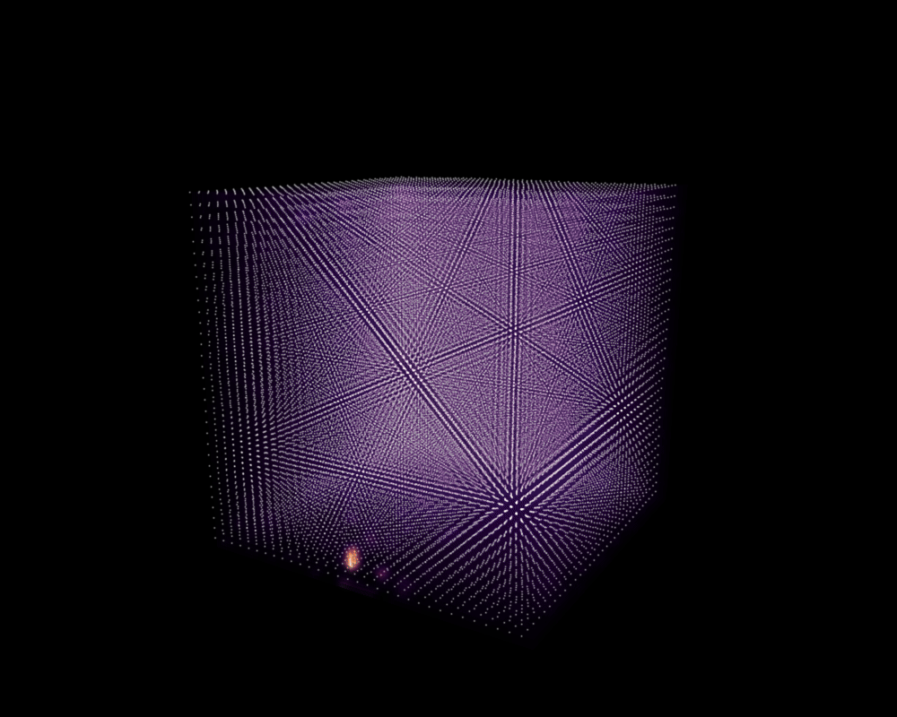

# Cosmological Simulations

This repository documents my work in cosmological N-body/hydrodynamics simulations. It contains a simulation program written in C++, along with documentation that explains the underlying physics and algorithms.

## Key Features Implemented

* **Gravity Solvers:**
    * **Particle-Particle (PP):** Direct summation for high-accuracy short-range forces.
    * **Particle-Mesh (PM):** FFT-based Poisson solver for efficient long-range forces.
    * **Fourier-Split PM:** A hybrid method combining PP and PM with a Gaussian frequency filter in Fourier space, yielding an analytical short-range Complementary Error Function force that guarantees monotonic force matching.
* **Cosmology:**
    * **Expanding Universe:** Simulation in comoving coordinates supporting generalized flat $\Lambda\text{CDM}$ cosmologies (including Einstein-de Sitter).
    * **Cosmological Integrator:** A Kick-Drift-Kick (KDK) Leapfrog scheme that handles Hubble drag.
    * **Initial Conditions:** Computation of cosmological initial conditions. Particles are perturbed from a uniform lattice using the Zel'dovich Approximation, deriving physical displacements and velocities from a Gaussian random field generated in Fourier space using the **BBKS (Bardeen-Bond-Kaiser-Szalay) transfer function** to model the Cold Dark Matter power spectrum.
* **Hydrodynamics:**
    * **Grid-Based (Eulerian) Solver:** Implements a finite-volume solver for the adiabatic Euler equations on a fixed grid, tracking conservative variables (density, momentum, energy).
    * **HLLC Riemann Solver:** Uses the Harten-Lax-van Leer-Contact (HLLC) approximate Riemann solver to compute fluxes between cells, capturing shocks and contact discontinuities without excessive numerical diffusion.
    * **Operator Splitting:** Employs a multi-physics fractional step method to decouple and integrate hydrodynamics, gravitational kicks, and radiative cooling within a single global timestep.
    * **Two-Way Coupling:** The gas density contributes to the total gravitational field via the PM solver, and the gas momentum/energy is updated by gravitational source terms during the KDK kicks.
    * **Radiative Cooling:** Implements an unconditionally stable, implicit Backward Euler solver (using Newton-Raphson root-finding) to calculate energy loss via Bremsstrahlung radiation, while preserving kinetic energy via the Dual Energy Formalism.
* **High-Performance Computing (HPC):**
    * **OpenMP Multithreading:** Heavy loops (such as the Riemann solver, mass assignment, and grid calculations) are parallelized across available CPU cores.
    * **SIMD Vectorization:** Core CPU mathematics leverage Eigen and AVX vectorization for cache-friendly, contiguous memory speedups.
    * **GPU Offloading:** The computationally expensive direct-summation particle forces can be optionally offloaded to NVIDIA GPUs using OpenMP `#pragma omp target` directives via the NVIDIA HPC SDK (nvc++) or the Clang/LLVM toolchain.
* **Numerical Methods:**
    * **Operator Splitting & Subcycling:** Employs a Strang-split fractional step method to decouple gravity, hydrodynamics, and cooling. Fast/stiff physics are **subcycled**.
    * **Cloud-in-Cell (CIC):** A symmetric mass-assignment and force-interpolation scheme for the PM grid to ensure momentum conservation.
    * **Periodic Boundary Conditions:** A "wrap-around" universe to model a representative patch of a larger cosmos.
    * **Gravitational Softening:** Plummer softening to ensure numerical stability during close encounters.
* **Configuration & I/O:**
    * **Parameter Input:** All simulation parameters (domain size, particle count, physics, output timing, etc.) are read at runtime from a plain-text `simulation.ini` file.
    * **Snapshot Output:** Simulation snapshots (including particle data, gas grids, and metadata) are saved periodically using the HDF5 (Hierarchical Data Format) file format.
    * **Diagnostics:** Real-time logging of conservation metrics (mass, momentum, energy) and performance timings to stdout and CSV.
    


## Repository Structure

* [`/src/`](src/): A high-performance C++ P³M + hydrodynamics cosmological simulation.
* [`/docs/`](docs/): Contains a "living book" titled **"Notes on Cosmological Simulations"** in Markdown format. It includes a `Makefile` to automatically build the source notes into EPUB and PDF files.
* [`/scripts/`](scripts/): Contains Python utilities for post-processing, including a 3D visualizer (`viewer.py`), a validation suite (`verify_run.py`) and a diagnostic dashboard (`cosmology_dashboard.py`) to extract and plot global physical evolution from the HDF5 outputs.

## Getting Started

### C++ Cosmological Code
This section refers to the ASIMOV (Advanced Simulation of Intergalactic Matter and Observable Voids) code.

1. **Prerequisites (Linux/Ubuntu):**
You need a C++ compiler, CMake, and the development libraries for HDF5, Eigen, and OpenMP. To utilize GPU offloading, the NVIDIA HPC SDK (`nvc++`) or the Clang/LLVM toolchain is also required.
```bash
sudo apt update
sudo apt install build-essential cmake libhdf5-dev libeigen3-dev libomp-dev

# Optional: For GPU offloading, install Clang or the NVIDIA HPC SDK.
# See NVIDIA's documentation for installation instructions.
sudo apt install clang lld

```


2. **Compile (with CMake):**
This project uses Modern CMake to find dependencies, download testing frameworks, and build the executables. You can build the project for standard CPU execution (using AVX/SIMD) or enable NVIDIA GPU offloading.
**Option A: Standard CPU Build (Default)**
```bash
mkdir build && cd build
cmake ..
make -j

```


**Option B: GPU Offload Build (Requires NVIDIA HPC SDK or Clang)**
```bash
mkdir build && cd build

# Force CMake to use nvc++ and enable the GPU offload toggle
CXX=nvc++ CC=nvc cmake -DUSE_GPU_OFFLOAD=ON ..

# Or Force CMake to use Clang
CXX=clang++ CC=clang cmake -DUSE_GPU_OFFLOAD=ON ..

make -j

```

    This will create two executables inside the `build` directory: the main simulation `asimov` and the automated test suite `run_tests`.

3.  **Run:**
    The build process automatically copies the `simulation.ini` file into the `build` directory. You can run the simulation from there:

    ```bash
    # From inside the 'build' directory:
    ./asimov
    ```

    The program will start and automatically load its configuration from `simulation.ini` and create a uniquely timestamped folder inside an `outputs/` directory to safely store all snapshots and diagnostics.

4.  **Run the automated tests:**
    To ensure the physics engine and mathematical utilities are functioning correctly on your machine, you can run the built-in test suite:
    ```bash
    # From inside the 'build' directory:
    ctest --output-on-failure
    ```

### Viewer
1.  **Prerequisites:** Ensure you have Python 3 and the following libraries installed:
    ```bash
    pip install numpy vispy h5py PyOpenGL matplotlib pyqt5
    ```
    *(Note: VisPy requires a working OpenGL implementation on your system for the 3D volumetric rendering).*
2.  **Run:** Navigate to the `scripts/` directory (or wherever the script is). Run the script passing an output folder generated by a simulation as an argument:
    ```bash
    python viewer.py <folder>
    ```

### Physical Validation Tool
While the C++ `ctest` suite verifies the code during compilation, the `verify_run.py` script performs validation on the generated HDF5 snapshots after a run. It checks for data integrity (NaNs, boundary escapes), strict thermodynamic positivity (preventing negative density/energy), and mass conservation across the entire simulation timeframe.

1.  **Prerequisites:** Requires `numpy` and `h5py` (which are already included if you installed the Viewer prerequisites).
2.  **Run:** Navigate to your project root and execute the script, passing the directory containing your `.hdf5` snapshots as an argument:
    ```bash
    python scripts/verify_run.py build/outputs/timestamped_folder/
    ```
    The script will print a report verifying the physical consistency of each snapshot.

### Cosmology Dashboard
The `cosmology_dashboard.py` script generates a visual diagnostic suite. It tracks the macroscopic state of the simulation, including cosmic expansion, structure growth, shock-heating, energy conservation, and thermodynamic phase diagrams.

1.  **Prerequisites:** Requires `matplotlib` and `camb` in addition to `numpy` and `h5py`.
    ```bash
    pip install matplotlib camb
    ```
2.  **Run:** Navigate to your project root and execute the script, passing the directory containing your `.hdf5` snapshots as an argument:
    ```bash
    python scripts/cosmology_dashboard.py build/outputs/timestamped_folder/
    ```
    This will open a window displaying the physical metrics of the run.

### Building the Book (Documentation)
The `/docs` folder contains a guide detailing the physics and algorithms used in this project. You can compile the Markdown source into EPUB and PDF documents.

1.  **Prerequisites:** You need Pandoc and a LaTeX distribution to generate the PDF.
    ```bash
    sudo apt update
    sudo apt install pandoc texlive-latex-base texlive-latex-extra
    ```
2.  **Build:** Navigate to the `docs` directory and use the provided `Makefile`.
    ```bash
    cd docs
    make        # Builds both EPUB and PDF
    
    # Or build them individually:
    make pdf
    make epub
    ```

## Guidebook

The companion document, built from the source files in [`/docs/`](docs/), is a "living book" that organizes and explains all the relevant physics and computer science concepts encountered during the development process. It is written in the style of a guide.

## Configuration Parameters

The simulation is configured using a standard INI file format. The configuration dictates the physical properties of the simulated universe, the grid resolution, the integration timesteps, and the data output frequency. Below is a breakdown of all available parameters by section.

### `[domain]`

Defines the spatial properties and resolution of the simulation box.

* **`domain_size`**: The internal code-unit length of the box (typically set to `1.0` for natural units).
* **`mesh_size_1d`**: The number of grid cells along one axis for the Poisson solver and hydrodynamics (e.g., `32` creates a 32x32x32 computational grid).
* **`num_particles_1d`**: The number of N-body particles along one axis (e.g., `32` creates 32,768 total particles). Often matched to `mesh_size` to avoid interpolation artifacts.
* **`box_size_mpc`**: The physical comoving size of the simulation box in Megaparsecs (Mpc). Used to map internal code units back to physical reality.

### `[cosmology]`

Defines the cosmological model of the universe.

* **`omega_baryon`**: The density parameter for normal (baryonic) matter.
* **`omega_M`**: The total matter density parameter (baryons + dark matter). Dark energy is dynamically assumed to be `1.0 - omega_M` for a flat universe.
* **`omega_lambda`**: The dark energy density parameter (cosmological constant).
* **`Hubble_h`**: The dimensionless physical Hubble parameter (*h*), where H0 = 100 * h km/s/Mpc.
* **`spectral_index`**: The primordial power spectrum index (*n_s*), typically `0.96` based on Planck data.
* **`sigma_8`**: The normalization of the power spectrum, defining the amplitude of density fluctuations at an 8 Mpc/h scale.
* **`expanding_universe`**: Boolean (`true` or `false`). If true, the code applies Hubble drag and stretches the comoving grid over time.

### `[gravity]`

* **`comoving_softening_factor`**: The baseline gravitational softening length as a multiplier of the mean inter-particle spacing.
* **`softening_cap_scale_factor`**: The expansion scale factor at which the physical size of the softening length is capped (so that its physical size won't grow more). This is needed to preserve halo density through the simulation.

### `[initial_conditions]`

Controls the generation of the primordial density field and particle distributions.

* **`initial_gas_temp_k`**: The physical temperature of the baryonic gas at `start_a`, in Kelvin.
* **`standing_particles`**: Boolean. If `true`, all N-body particles remain completely stationary throughout the entire duration of the simulation. Their positions and velocities are never updated. This is strictly a debugging feature.
* **`seed`**: Integer seed for the random number generator, ensuring reproducible initial density fields.

### `[hydro]`

Configures the fluid dynamics solver for the baryonic gas.

* **`use_hydro`**: Boolean flag to enable or disable the hydrodynamics solver. If `false`, the code runs as a dark-matter-only N-body simulation.
* **`gamma`**: The adiabatic index (ratio of specific heats) of the gas. Set to `1.6666666667` (5/3) for a monatomic, non-relativistic ideal gas.
* **`enable_cooling`**: Boolean. If `true`, the code activates the implicit radiative cooling solver to extract thermal energy from the gas over time.
* **`primordial_mu`**: The mean molecular weight of the gas (e.g., `1.22` for neutral primordial hydrogen/helium gas). Used to accurately map internal energy to physical temperatures.
* **`temp_floor_k`**: The absolute minimum temperature (in Kelvin) the gas is allowed to reach. Physically, this ensures the gas does not cool below the baseline heat of the universe, such as the Cosmic Microwave Background (CMB). Note that internally, the radiative cooling module halts at `cooling_floor_k` regardless, but this parameter acts as the ultimate mathematical safety net for the hydrodynamics engine.
* **`cooling_cutoff_k`**: The absolute minimum temperature (in Kelvin) the gas is allowed to reach via radiative cooling. The gas does not radiate below this temperature.

### `[subgrid]`

Configures the subgrid models.

* **`enable_subgrid_gravity`**: If enabled, the code calculates short-range Particle-Particle (PP) gravitational forces between the collisionless dark matter particles and the baryonic gas. Otherwise there are not intra-cell interactions between them.
* **`enable_subgrid_clumping`**: Enables the cooling subgrid model. If enabled, the code applies a density-dependent clumping factor to scale the radiative cooling rate, compensating for unresolved high-density gas on coarse grids.
* **`subgrid_clumping_amplitude`**: The amplitude for the subgrid cooling factor. Set to -1 to let the simulation auto-calculate this based on the grid resolution.

### `[p3m]`

Configures the Particle-Particle Particle-Mesh (P³M) gravity solver.

* **`use_pm`**: Boolean. Enables the long-range Particle-Mesh (PM) force calculation via Fast Fourier Transform.
* **`use_pp`**: Boolean. Enables the short-range Particle-Particle (PP) direct summation for sub-grid resolution.
* **`pm_smoothing_cells`**: The fundamental mathematical scale ($r_s$) of the Fourier-space Gaussian filter, defined in units of grid cells. Determines how smoothly the grid force is blunted to avoid anisotropic grid artifacts. Minimum mathematically sound value is 1.0.
* **`cutoff_radius_factor`**: A multiplier that dictates the cutoff radius relative to the smoothing scale ($r_c = \text{factor} \times r_s$). Because the short-range force is an erfc exponential decay, the cutoff must be placed far enough out to avoid force discontinuity. Typically set to at least 3.5.

### `[time]`

Controls the adaptive timestepping and integration limits.

* **`max_dt_dynamical_factor`**: Acts as a safety ceiling. Multiplied by the dynamical time, it defines the absolute maximum allowed timestep.
* **`gravity_accuracy_eta`**: The accuracy tolerance for the gravitational timestep. Smaller values yield more accurate particle orbits but require more integration steps.
* **`cfl_safety_factor`**: The Courant-Friedrichs-Lewy (CFL) number. Restricts the hydrodynamics timestep to ensure information does not travel further than one grid cell per step (must be < 1.0, typically `0.3`).
* **`a_start`**: The scale factor at which the simulation begins (e.g., `0.02` corresponds to redshift z = 49).
* **`a_end`**: The scale factor at which the simulation terminates. Set to `1.0` to run up to the present day (z = 0).

### `[output]`

Manages how and when the simulation writes data to disk.

* **`save_hdf5_every_delta_a`**: The interval for writing full snapshot files (particles, mesh densities, velocities) to disk, measured in scale factor increments.
* **`debug_info_every_seconds`**: The frequency (in seconds) at which the code prints its current status, timestep, and performance metrics to the console/log.
* **`enable_energy_diagnostics`**: Boolean. If `true`, the code continuously calculates and verifies the conservation of energy and momentum, writing the error margins to the diagnostic file.

### `[HPC]`

High-Performance Computing (HPC) and hardware execution settings.

* **`num_threads`**: The maximum number of OpenMP threads to spawn. If set to `0`, the simulation will defer to the terminal's `OMP_NUM_THREADS` environment variable, or default to all available CPU cores. 
* **`use_gpu`**: Boolean. If set to `true`, the engine offloads compute-heavy kernels to the GPU. *Note: If enabled but no compatible OpenMP offload device is detected at runtime, the code falls back to CPU execution.*

## HDF5 Snapshot Format & Units

ASIMOV exports simulation data using the industry-standard HDF5 format. To prevent floating-point underflow and guarantee bit-for-bit lossless restarts, the engine uses a **Comoving Eulerian Formulation**. This means that almost all arrays are exported in raw **comoving code units**.

It is the responsibility of the post-processing tools (like the included Python dashboard) to use the scale factor ($a$) and the conversion multipliers in the file header to map these arrays back to physical reality.

Every snapshot contains the following internal structure:

### Metadata Subgroups (`/Header`, `/Config`, `/Units`)

To keep the snapshots organized, all metadata attributes are divided into three subgroups:

**1. `/Header`**
This group contains the global state of the simulation for the current snapshot:

* **`scale_factor`**: The current scale factor $a$ of the universe.
* **`simulation_time`**: The current physical time elapsed (in code units).

**2. `/Config`**
This group contains a complete dump of the `simulation.ini` configuration used to run the simulation, guaranteeing that every snapshot is fully self-describing. The attribute names here mirror the keys in the INI file (e.g., `mesh_size`, `omega_M`, `use_hydro`).

**3. `/Units`**
This group contains the physical unit conversion multipliers:

* **`unit_length_in_mpc`**: Multiplier to convert code length to comoving Megaparsecs.
* **`unit_time_in_gyr`**: Multiplier to convert code time to Gigayears.
* **`unit_velocity_in_kms`** / **`unit_velocity_in_cgs`**: Multipliers for peculiar velocity.
* **`unit_mass_in_msun`**: Multiplier to convert code mass to Solar Masses.
* **`unit_density_in_cgs`**: Multiplier to convert the raw code density to comoving CGS density ($\text{g/cm}^3$). To calculate the true physical density, you must multiply the code density by this factor, and then divide the result by $a^3$.
* **`factor_u_to_t`**: Multiplier to convert the specific internal energy ($U$) of the gas in code units directly into Physical Temperature in Kelvin. This bundles the mean molecular weight ($\mu$), adiabatic index ($\gamma$), and Boltzmann constant into a single convenient factor. *(Note: To get specific internal energy $U$ from the HDF5 file, you must take the `energy` array, subtract the kinetic energy, and divide by the `density` array).*

### Dark Matter Particles (`/Particles`)

This group contains flat 1D arrays for all N-body dark matter particles.

* **`position_[x,y,z]`**: Comoving spatial coordinates. Bound between `[0, domain_size]`. To get the true physical distance, apply the conversion factors and scale by $a$.
* **`velocity_[x,y,z]`**: Peculiar velocities in code units. To get physical peculiar velocities, apply the conversion factors and scale by $a$.
* **`acceleration_[x,y,z]`**: Gravitational acceleration in code units.
* **`mass`**: Particle mass in code units.

### Baryonic Gas (`/Gas`)

If hydrodynamics is enabled (`use_hydro = true`), this group contains the fluid state of the simulation.

**Group Attributes:**

* **`cumulative_radiated_energy`**: *(Only present if `enable_cooling = true`)*. The total, integrated energy radiated away by the gas up to the current snapshot in code units. To convert this value to true physical energy (Ergs), multiply it by the physical energy unit conversion factor and **multiply by $a^2$**.
* **`cumulative_gravitational_work`**: The total, integrated kinetic energy injected into the gas by the gravitational field up to the current snapshot in code units. To convert this value to true physical energy (Ergs), multiply it by the physical energy unit conversion factor and **multiply by $a^2$**.
* **`cumulative_expansion_work`**: The total, integrated $P dV$ thermodynamic work performed by the gas against the expanding cosmic metric up to the current snapshot in code units. To convert this value to true physical energy (Ergs), multiply it by the physical energy unit conversion factor and **multiply by $a^2$**.

**3D Eulerian Grids:**
These datasets are flattened into 1D arrays in row-major order:

* **`density`**: The *comoving* mass density. Because the physical volume of the grid cells expands with the universe, to calculate the true physical density, you must multiply this array by the physical mass/volume unit conversions and **divide by $a^3$**.
* **`momentum_[x,y,z]`**: Comoving momentum density.
* **`energy`**: The total comoving energy density (Kinetic + Internal). To convert this grid to true physical energy, you must apply the conversion factors and **multiply by $a^2$**.
* **`pressure`**: Comoving thermal pressure. Like energy, it must be scaled by $a^2$ to reflect physical pressure.
* **`temperature`**: *(Only present if `enable_cooling = true`)*. Unlike the other grids, the simulation engine explicitly converts the internal energy of the gas into **Physical Kelvin** before writing this array to disk. No scale factor corrections are needed for this dataset.
